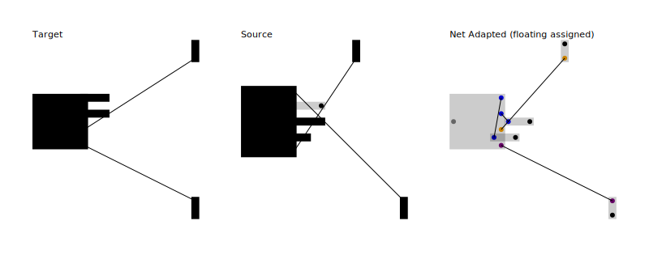

# bpc-graph

A box pin color (BPC) graph is a specialized graph structure where:

- Boxes contain pins
- Pins belong to a network
- Pins are coloured to describe signal type

Boxes can be **fixed** (they know their position) or **floating** (no position yet). Each
pin stores an offset relative to its box. When all pins on a network are visualised, a
schematic like connection graph is produced.

This repository provides utilities for manipulating and comparing BPC graphs.

## Function Links

- [assignFloatingBoxPositions](#assignfloatingboxpositions)
- [netAdaptBpcGraph](#netadaptbpcgraph)
- [renetworkWithCondition](#renetworkwithcondition)

## Where BPC graphs are used

When automatically laying out schematics the tools in this repo convert an initial
"floating" design into a fixed layout. Networks can be split, boxes can be adapted to a
template and the resulting graph can be rendered with a force directed solver.


## Installation

```bash
bun add bpc-graph
```

## Quick Example

```ts
import { getGraphicsForBpcGraph } from "bpc-graph"
import { getSvgFromGraphicsObject } from "graphics-debug"

const graph = {
  boxes: [
    { kind: "fixed", boxId: "A", center: { x: 0, y: 0 } },
    { kind: "fixed", boxId: "B", center: { x: 2, y: 0 } },
  ],
  pins: [
    { boxId: "A", pinId: "P1", offset: { x: 0.5, y: 0 }, color: "red", networkId: "N1" },
    { boxId: "B", pinId: "P1", offset: { x: -0.5, y: 0 }, color: "red", networkId: "N1" },
  ],
}

const svg = getSvgFromGraphicsObject(getGraphicsForBpcGraph(graph), { backgroundColor: "white" })
```

The snapshot generated in `tests/readme/getGraphicsExample.test.ts` renders as:


## API

### Graph Utilities

- **getGraphBounds(graph)** → `{ minX, minY, maxX, maxY }`
- **getPinPosition(graph, pinId)** → absolute coordinates of a pin
- **getPinDirection(graph, pinId)** → `"x-" | "x+" | "y-" | "y+" | null`

### Graph Editing

#### assignFloatingBoxPositions


#### netAdaptBpcGraph



#### renetworkWithCondition


### Conversion Utilities

- **convertToFlatBpcGraph(mixed)** – flatten a BPC graph into nodes and undirected edges
- **convertFromFlatBpcGraph(flat)** – rebuild a mixed graph from the flat representation

### Similarity & Layout

- **getBpcGraphWlDistance(a, b)** – compute Weisfeiler-Leman distance between graphs
- **ForceDirectedLayoutSolver** – physics based solver for positioning boxes

All type definitions can be imported from `bpc-graph` as well and are located in
`lib/types.ts`.

